##########
Test cases
##########

The following test cases are provided for verification with the original Aquaplus software (which is the ancestor of NEMOH) and/or HYDROSTAR commercial software :cite:p:`HYDROSTAR`. Note that Tecplot’s layout files ``.lay`` are provided in the relevant test case folder for plotting in Tecplot.

**********
1_Cylinder
**********

Half-symmetric body mesh, deep water case, wave direction :math:`0^{\circ}`. The results are shown in :numref:`fig:Cylinder`.

.. _`fig:Cylinder`:
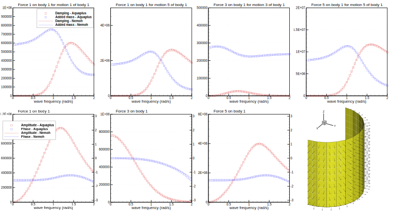

   Comparison of the first order results between NEMOH and AQUAPLUS for the test case **1_Cylinder**

*********
2_2Bodies
*********

Half-symmetric body mesh, two different bodies, water depth :math:`20` m, wave direction :math:`45^{\circ}`. The results are shown in :numref:`fig:2Bodies`.

.. _`fig:2Bodies`:
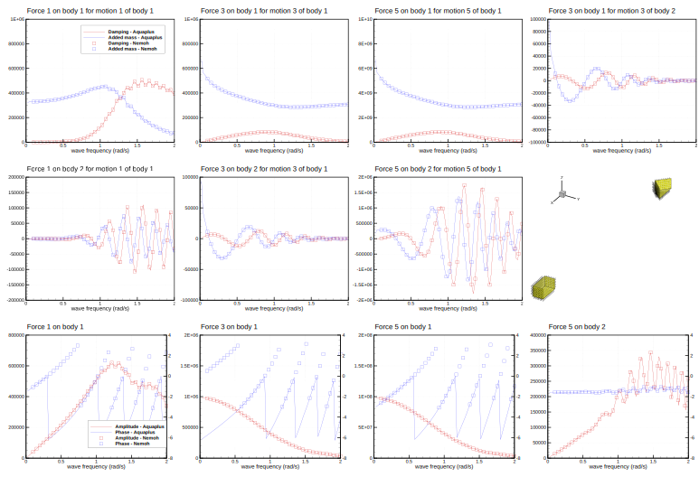

   Comparison of the first order results between NEMOH and AQUAPLUS for the test case **2_2Bodies**

****************
3_Nonsymmetrical
****************

Full non-symmetrical body mesh, deep-water, wave direction :math:`0^{\circ}`. Comparison of NEMOH results against Aquaplus are shown in :numref:`fig:NonSymmetrical_1` and :numref:`fig:NonSymmetrical_2`, a slight difference are observed in the results. Added mass and damping coefficients comparison between NEMOH and HYDROSTAR are shown in :numref:`fig:NonSymmetrical_mass` and :numref:`fig:NonSymmetrical_damp`, and for the excitation force is in :numref:`fig:NonSymmetrical_excforce`. Good agreement between NEMOH and HYDROSTAR is achieved.

.. _`fig:NonSymmetrical_1`:
.. figure:: figures/Ver_NonSymmetrical_1.svg
   :align: center

   Comparison of the first order results between NEMOH and AQUAPLUS for the test case **3_Nonsymmetrical**

.. _`fig:NonSymmetrical_2`:
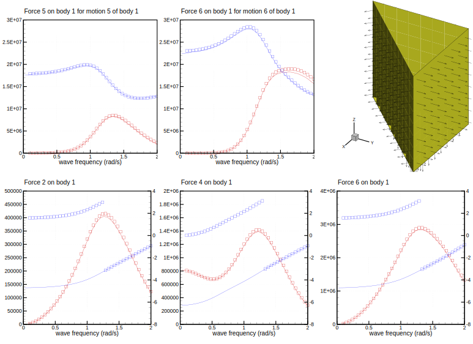

   Comparison of the first order results between NEMOH and AQUAPLUS for the test case **3_Nonsymmetrical**

.. _`fig:NonSymmetrical_mass`:
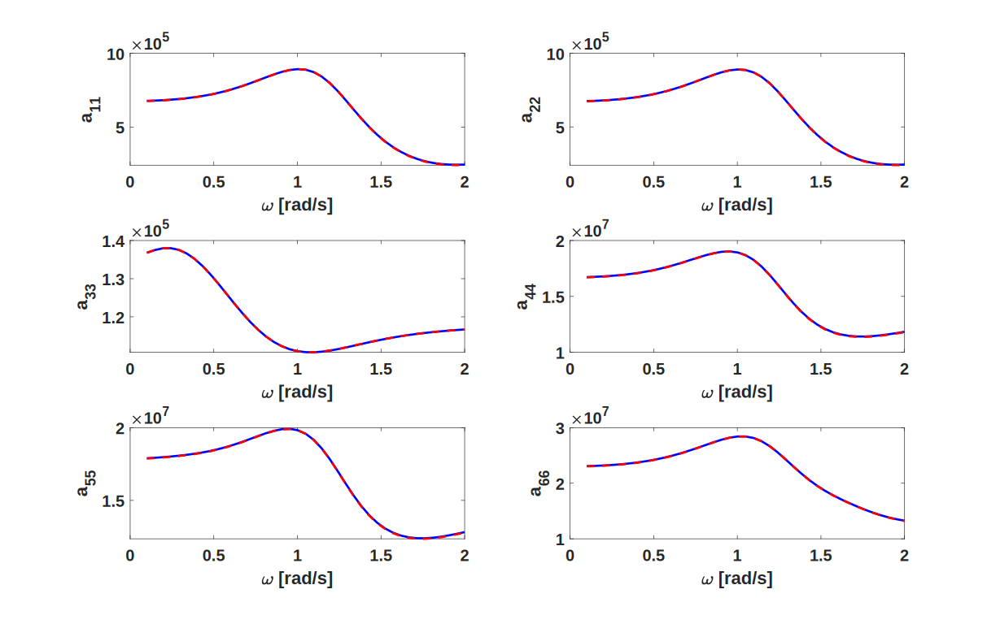

   Comparison of added mass coefficients between NEMOH, red dashed-line, and HYDROSTAR, blue solid-line, for the test case **3_Nonsymmetrical**

.. _`fig:NonSymmetrical_damp`:
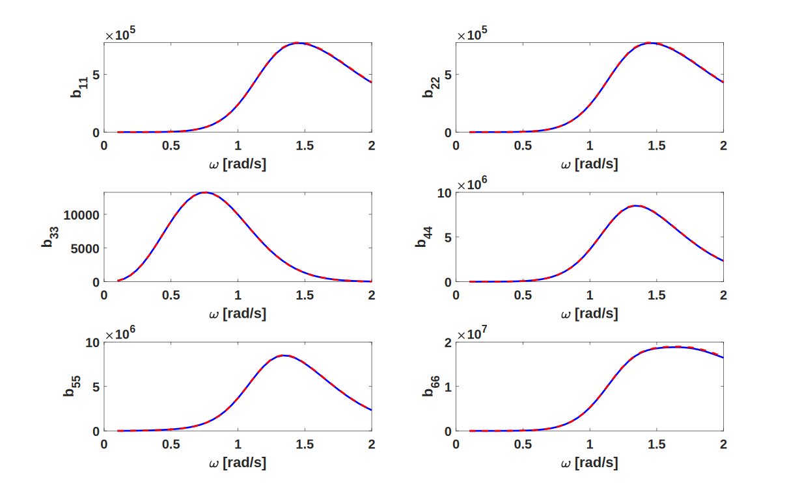

   Comparison of damping coefficients between NEMOH, red dashed-line, and HYDROSTAR, blue solid-line, for the test case **3_Nonsymmetrical**

.. _`fig:NonSymmetrical_excforce`:
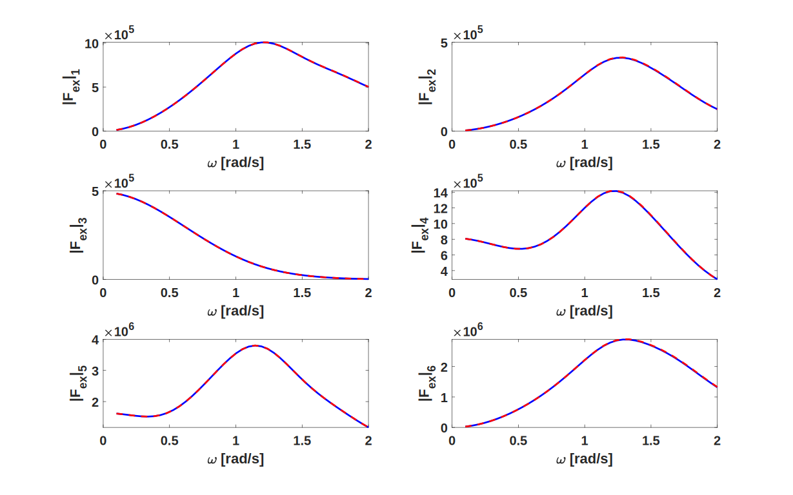

   Comparison of excitation force between NEMOH, red dashed-line, and HYDROSTAR, blue solid-line, for the test case **3_Nonsymmetrical**

****************
4_Postprocessing
****************

Half-symmetric body mesh, water depth :math:`10` m, wave direction :math:`0^{\circ}`. This test case shows a comparison of the free-surface elevation and the Kochin function. The results are shown in :numref:`fig:PostProcessing`. The phase difference, :math:`\pm \pi/2`, of wave elevation between NEMOH and AQUAPLUS is due to different conventions of the incident potential.

.. _`fig:PostProcessing`:
.. figure:: figures/Ver_PostProcessing.svg
   :align: center

   Comparison of the diffracted wave elevation, the diffraction Kochin function between NEMOH and AQUAPLUS, test case **4_Postprocessing**

***********
5_QuickTest
***********

Shows a quantitative comparison of force and free-surface for the first-frequency diffraction problem. The comparison results are shown in the command window for all the test cases inside the directory ``5_QuickTest``.

****************
6_box_coarsemesh
****************

Shows the procedure for running the code starting with the executable **``mesh``** with a coarse description mesh file, ``meshbox``. No reference data is given in this test case.

*******************
7_Solvers_Check_OC3
*******************

Tests the performance of the three difference linear solvers, Gauss elimination, LU decomposition and GMRES. Reference logfiles reporting the computational time of the solvers are provided.

*********************
8a_Cylinder_irregfreq
*********************

Shows the results with and without irregular frequencies removal (IRR) method. The results are verified against HYDROSTAR with IRR and shown in :numref:`fig:Cylinder_IRR_addedmass` and :numref:`fig:Cylinder_IRR_dampcoef` for the added mass and damping coefficients and in :numref:`fig:Cylinder_IRR_excforce` for the excitation forces. The mesh used was obtained using GMSH :cite:p:`GMSH` and is shown in :numref:`fig:meshesCylinder`.

.. _`fig:meshesCylinder`:
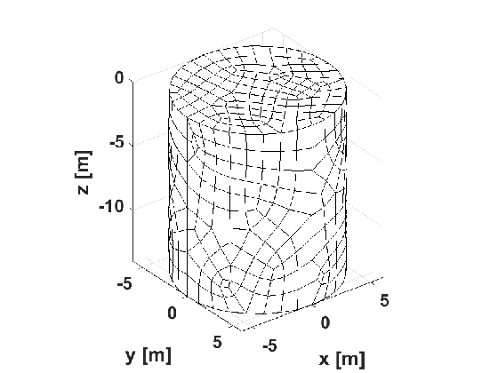

   Body boundary mesh for the Cylinder used for test case **8a_Cylinder_irregfreq** and **8b_QTF_Cylinder**.

.. _`fig:Cylinder_IRR_addedmass`:
.. figure:: figures/Cylinder/addedmass.svg
   :align: center

   Comparison of added masscoefficients between NEMOH without irregular frequencies removal (IRR), green dash-dotted line, NEMOH with IRR, red dashed-line and HYDROSTAR with IRR, blue solid-line, for the test-case **8a_Cylinder_irregfreq**

.. _`fig:Cylinder_IRR_dampcoef`:
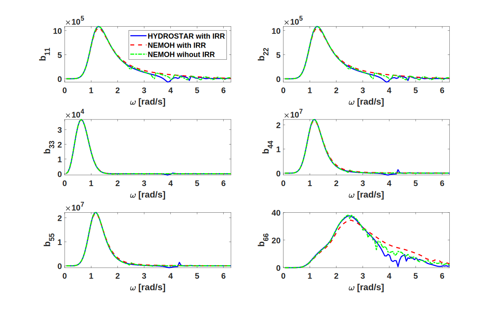

   Comparison of damping coefficients between NEMOH without irregular frequencies removal (IRR), green dash-dotted line, NEMOH with IRR, red dashed-line and HYDROSTAR with IRR, blue solid-line, for the test-case **8a_Cylinder_irregfreq**

.. _`fig:Cylinder_IRR_excforce`:
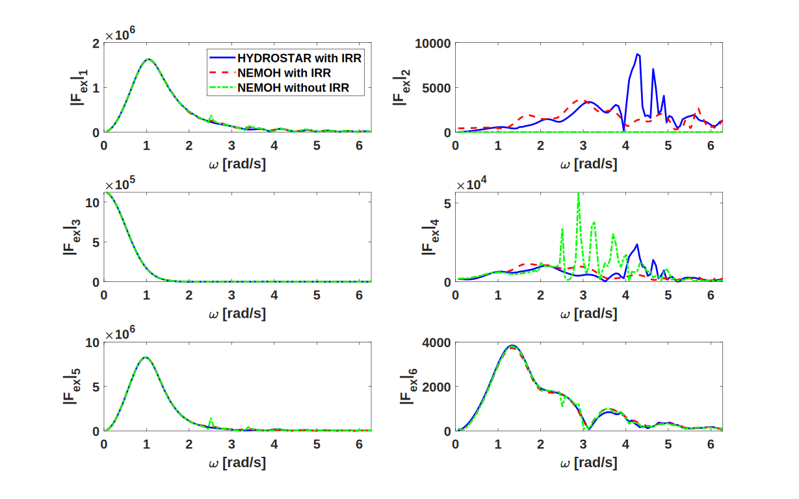

   Comparison of excitation force between NEMOH without irregular frequencies removal (IRR), green dash-dotted line, NEMOH with IRR, red dashed-line and HYDROSTAR with IRR, blue solid-line, for the test-case 8a_Cylinder_irregfreq

The following test cases are provided for the QTF verification with HYDROSTAR software :cite:p:`HYDROSTAR`.

***************
8b_QTF_Cylinder
***************

Full body mesh with lid panels, CoG :math:`(0,0,0)`, deep water, wave direction :math:`0^{\circ}`, the difference-frequency QTF DUOK+HASBO. The results are shown in the density plot, :numref:`fig:QTFM_Cylinder_surge`, :numref:`fig:QTFM_Cylinder_heave` and :numref:`fig:QTFM_Cylinder_pitch`, and in the off-diagonal line plot, :numref:`fig:QTFM_diag_Cylinder_surge`, :numref:`fig:QTFM_diag_Cylinder_heave` and :numref:`fig:QTFM_diag_Cylinder_pitch`. The mesh used was obtained using GMSH :cite:p:`GMSH` and is shown in :numref:`fig:meshesCylinder`.

.. _`fig:QTFM_Cylinder_surge`:
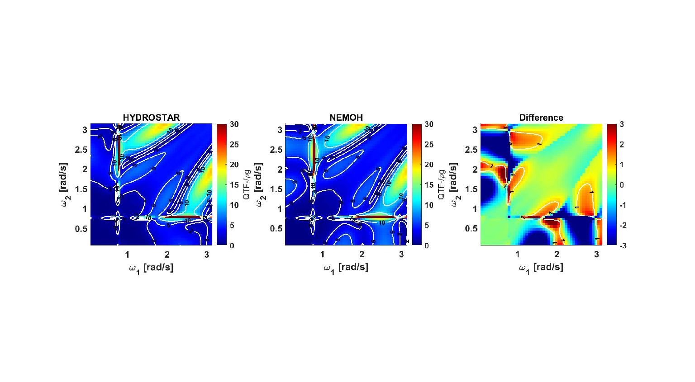

   Density plots of the normalized surge difference frequency QTF magnitude (without the free-surface integrals) for the floating Cylinder (test case **8b_QTF_Cylinder**. HYDROSTAR results are on the left column, NEMOH results are on the middle column and the difference on the right column.

.. _`fig:QTFM_Cylinder_heave`:
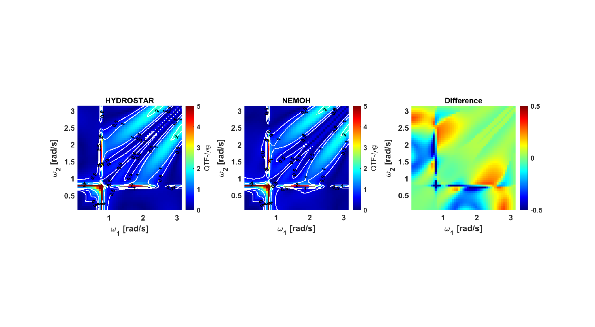

   Density plots of the normalized heave difference frequency QTF magnitude (without the free-surface integrals) for the floating Cylinder (test case **8b_QTF_Cylinder**. HYDROSTAR results are on the left column, NEMOH results are on the middle column and the difference on the right column.

.. _`fig:QTFM_Cylinder_pitch`:
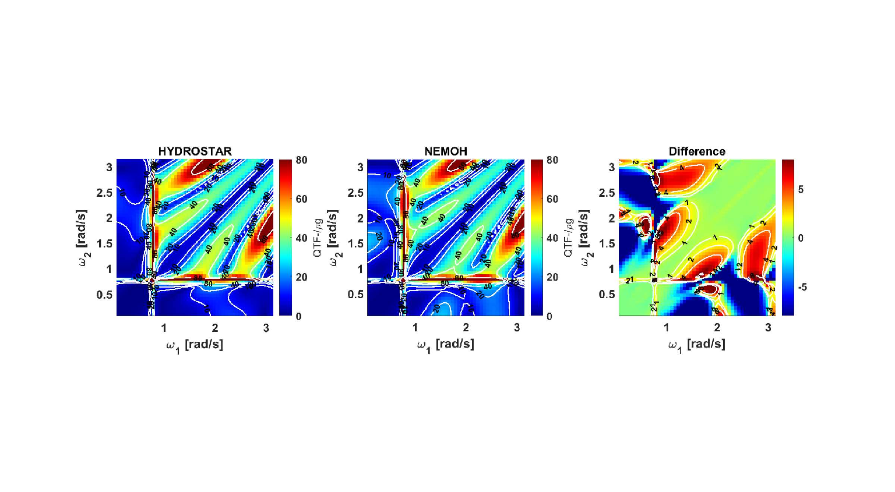

   Density plots of the normalized pitch difference frequency QTF magnitude (without the free-surface integrals) for the floating Cylinder (test case **8b_QTF_Cylinder**. HYDROSTAR results are on the left column, NEMOH results are on the middle column and the difference on the right column.

.. _`fig:QTFM_diag_Cylinder_surge`:
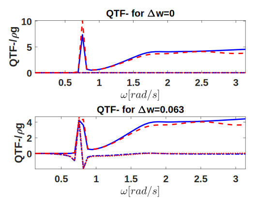

   Comparison of the surge off-diagonal difference frequency QTF for the Cylinder (test case **8b_QTF_Cylinder**) between HYDROSTAR, real part (blue, solid-line), imaginary part (blue, dashed-dot line) and NEMOH, real part (red, dashed-line), imaginary part (red, dotted-line).

.. _`fig:QTFM_diag_Cylinder_heave`:
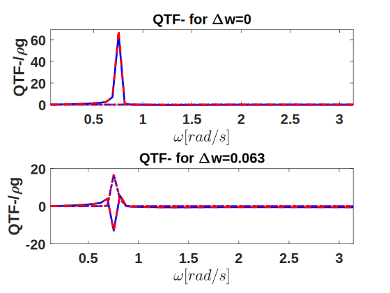

   Comparison of the heave off-diagonal difference frequency QTF for the Cylinder (test case **8b_QTF_Cylinder**) between HYDROSTAR, real part (blue, solid-line), imaginary part (blue, dashed-dot line) and NEMOH, real part (red, dashed-line), imaginary part (red, dotted-line).

.. _`fig:QTFM_diag_Cylinder_pitch`:
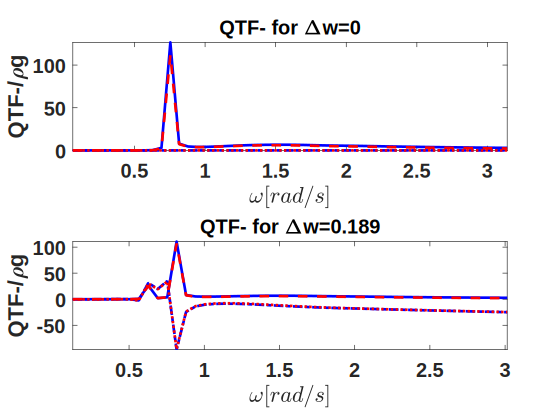

   Comparison of the pitch off-diagonal difference frequency QTF for the Cylinder (test case **8b_QTF_Cylinder**) between HYDROSTAR, real part (blue, solid-line), imaginary part (blue, dashed-dot line) and NEMOH, real part (red, dashed-line), imaginary part (red, dotted-line).

*************************
9_QTF_OC4_Semisubmersible
*************************

Full body mesh with lid panels, CoG :math:`(0,0,0)`, water depth 200 m, wave direction :math:`0^{\circ}` and :math:`30^{\circ}`, bi-directional QTF, the difference-frequency QTF DUOK+HASBO. The results are shown in the density plot, :numref:`fig:QTFM_OC4_surge`, :numref:`fig:QTFM_OC4_heave` and :numref:`fig:QTFM_OC4_pitch`, and in the off-diagonal line plot, :numref:`fig:QTFM_diag_OC4_surge`, :numref:`fig:QTFM_diag_OC4_heave` and :numref:`fig:QTFM_diag_OC4_pitch`, of the bi-directional QTF :math:`(\beta_1,\beta_2)=(0^{\circ},30^{\circ})`. The mesh used was obtained using GMSH :cite:p:`GMSH` and is shown in :numref:`fig:meshesOC4`.

.. _`fig:meshesOC4`:
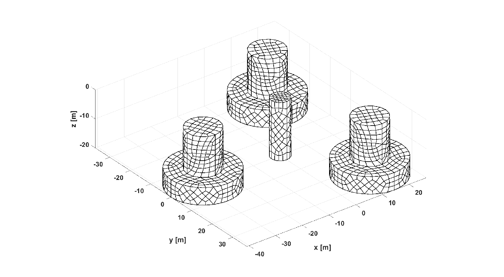

   Body boundary mesh for for the OC4-platform used for test case **9_QTF_OC4_Semisubmersible**.

.. _`fig:QTFM_OC4_surge`:
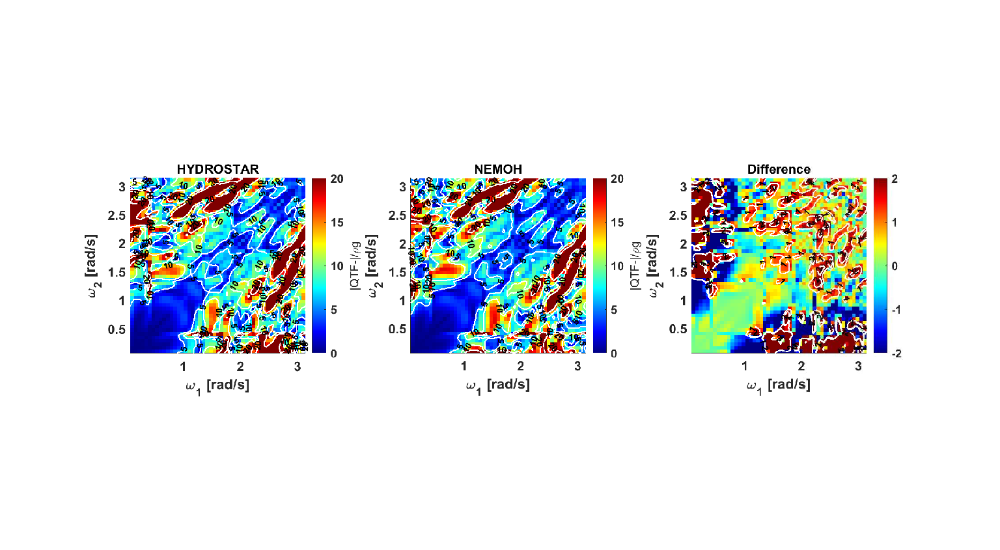

   Density plots of the normalized bi-directional, :math:`(\beta_1,\beta_2)=(0^{\circ},30^{\circ})`, surge difference frequency QTF magnitude (without the free-surface integrals) for the floating OC4-semisubmersible platform (test case **9_QTF_OC4_Semisubmersible**). HYDROSTAR results are on the left column, NEMOH results are on the middle column and the difference on the right column.

.. _`fig:QTFM_OC4_heave`:
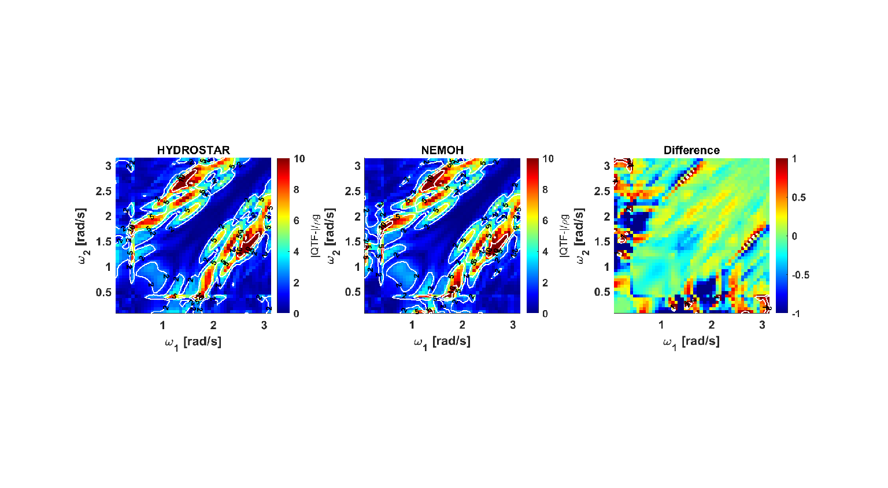

   Density plots of the normalized bi-directional, :math:`(\beta_1,\beta_2)=(0^{\circ},30^{\circ})`, heave difference frequency QTF magnitude (without the free-surface integrals) for the floating OC4-semisubmersible platform (test case **9_QTF_OC4_Semisubmersible**). HYDROSTAR results are on the left column, NEMOH results are on the middle column and the difference on the right column.

.. _`fig:QTFM_OC4_pitch`:
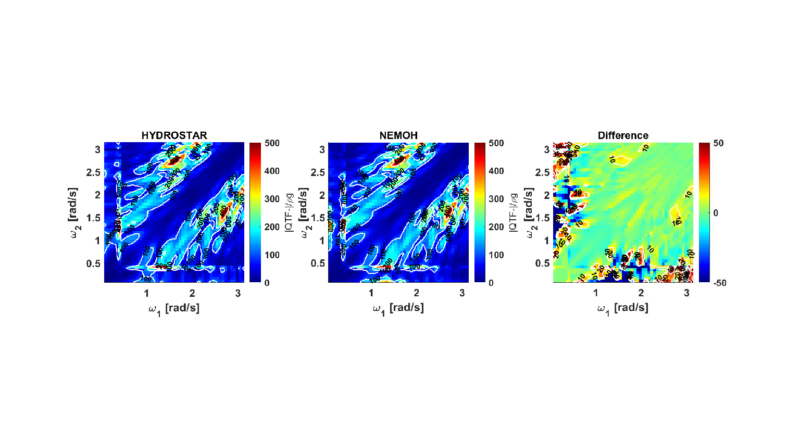

   Density plots of the normalized bi-directional, :math:`(\beta_1,\beta_2)=(0^{\circ},30^{\circ})`, pitch difference frequency QTF magnitude (without the free-surface integrals) for the floating OC4-semisubmersible platform (test case **9_QTF_OC4_Semisubmersible**). HYDROSTAR results are on the left column, NEMOH results are on the middle column and the difference on the right column.

.. _`fig:QTFM_diag_OC4_surge`:
.. figure:: figures/OC4/QTFM_Surge_beta030_diag.svg
   :align: center

   Comparison of the off-diagonal bi-directional, :math:`(\beta_1,\beta_2)=(0^{\circ},30^{\circ})`, surge difference frequency QTF for the OC4-semisubmersible platform (test case **9_QTF_OC4_Semisubmersible**) between HYDROSTAR, real part (blue, solid-line), imaginary part (blue, dashed-dot line) and NEMOH, real part (red, dashed-line), imaginary part (red, dotted-line).

.. _`fig:QTFM_diag_OC4_heave`:
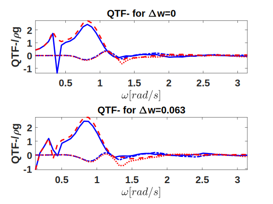

   Comparison of the off-diagonal bi-directional, :math:`(\beta_1,\beta_2)=(0^{\circ},30^{\circ})`, heave difference frequency QTF for the OC4-semisubmersible platform (test case **9_QTF_OC4_Semisubmersible**) between HYDROSTAR, real part (blue, solid-line), imaginary part (blue, dashed-dot line) and NEMOH, real part (red, dashed-line), imaginary part (red, dotted-line).

.. _`fig:QTFM_diag_OC4_pitch`:
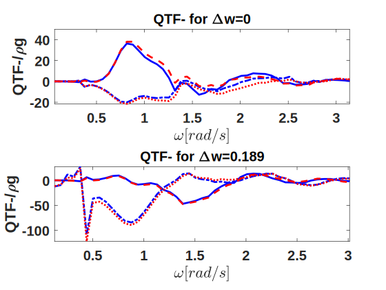

   Comparison of the off-diagonal bi-directional, :math:`(\beta_1,\beta_2)=(0^{\circ},30^{\circ})`, pitch difference frequency QTF for the OC4-semisubmersible platform (test case **9_QTF_OC4_Semisubmersible**) between HYDROSTAR, real part (blue, solid-line), imaginary part (blue, dashed-dot line) and NEMOH, real part (red, dashed-line), imaginary part (red, dotted-line).

****************
10a_QTF_SOFTWIND
****************

Half symmetric body mesh with lid panels, CoG :math:`(0,0,-71.56)`, water depth 200 m, wave direction :math:`0^{\circ}` and :math:`30^{\circ}`, bi-directional QTF, the difference-frequency QTF DUOK+HASBO. The results are shown in the density plot, :numref:`fig:QTFM_SOFTWIND_surge`, :numref:`fig:QTFM_SOFTWIND_heave` and :numref:`fig:QTFM_SOFTWIND_pitch`, and in the off-diagonal line plot, :numref:`fig:QTFM_diag_softwind_surge`, :numref:`fig:QTFM_diag_softwind_heave` and :numref:`fig:QTFM_diag_softwind_pitch`, of the bi-directional QTF :math:`(\beta_1,\beta_2)=(0^{\circ},30^{\circ})`. The mesh used was obtained using GMSH :cite:p:`GMSH` and is shown in :numref:`fig:meshesSoftwind_body`.

.. _`fig:meshesSoftwind_body`:
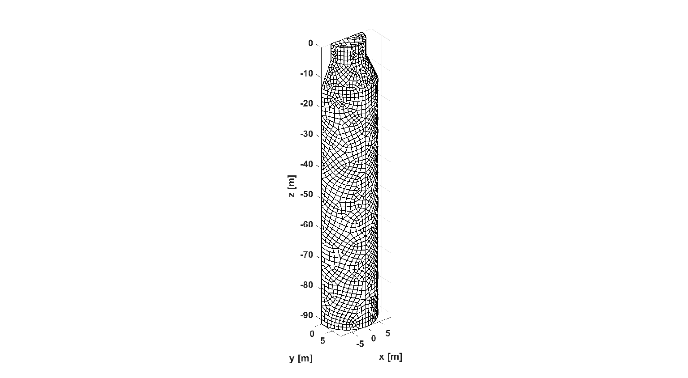

   Body boundary mesh for the SOFTWIND platform, used in test cases **10a_QTF_SOFTWIND** and  **10b_QTF_SOFTWIND_FS**

.. _`fig:meshesSoftwind_FS`:
.. figure:: figures/Softwind/FSmesh.svg
   :align: center

   Free surface mesh for the SOFTWIND platform, used in test case **10b_QTF_SOFTWIND_FS**

.. _`fig:QTFM_SOFTWIND_surge`:
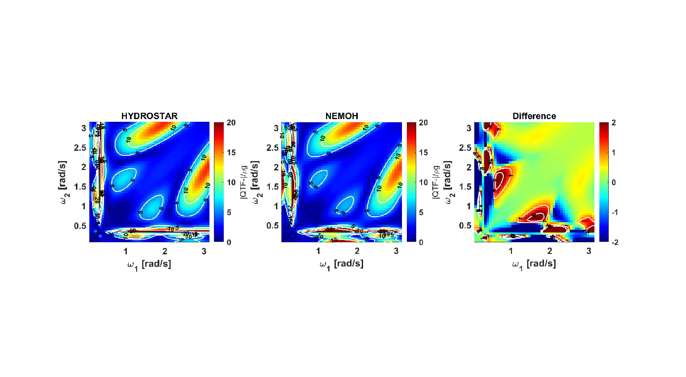

   Density plots of the normalized bi-directional, :math:`(\beta_1,\beta_2)=(0^{\circ},30^{\circ})`, surge difference frequency QTF magnitude (without the free-surface integrals) for the floating SOFTWIND platform (test case **10a_QTF_SOFTWIND**). HYDROSTAR results are on the left column, NEMOH results are on the middle column and the difference on the right column.

.. _`fig:QTFM_SOFTWIND_heave`:
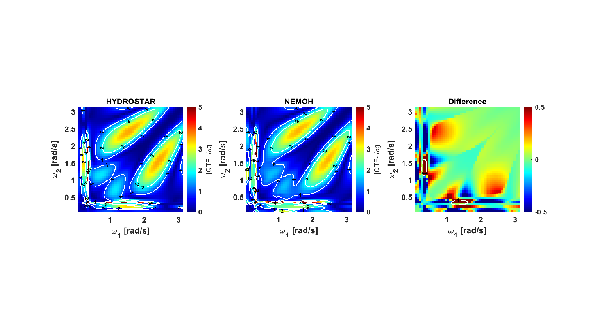

   Density plots of the normalized bi-directional, :math:`(\beta_1,\beta_2)=(0^{\circ},30^{\circ})`, heave difference frequency QTF magnitude (without the free-surface integrals) for the floating SOFTWIND platform (test case **10a_QTF_SOFTWIND**). HYDROSTAR results are on the left column, NEMOH results are on the middle column and the difference on the right column.

.. _`fig:QTFM_SOFTWIND_pitch`:
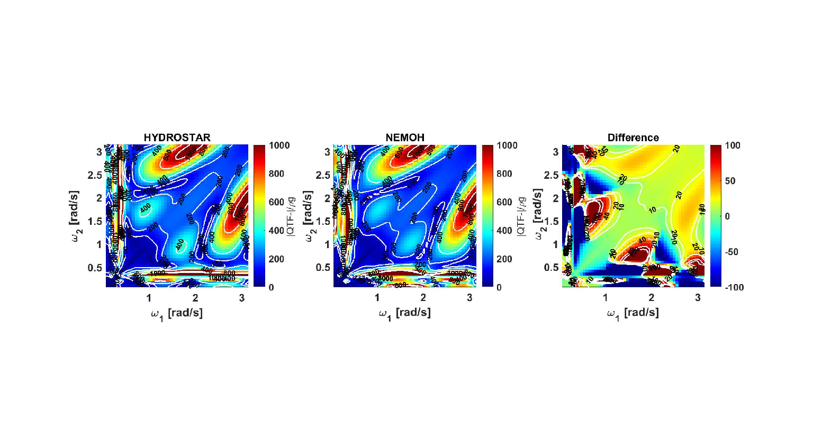

   Density plots of the normalized bi-directional, :math:`(\beta_1,\beta_2)=(0^{\circ},30^{\circ})`, pitch difference frequency QTF magnitude (without the free-surface integrals) for the floating SOFTWIND platform (test case **10a_QTF_SOFTWIND**). HYDROSTAR results are on the left column, NEMOH results are on the middle column and the difference on the right column.

.. _`fig:QTFM_diag_softwind_surge`:
.. figure:: figures/Softwind/QTFM_Surge_beta030_diag.svg
   :align: center

   Comparison of the off-diagonal bi-directional, :math:`(\beta_1,\beta_2)=(0^{\circ},30^{\circ})`, surge difference frequency QTF for the SOFTWIND platform (test case **10a_QTF_SOFTWIND**) between HYDROSTAR, real part (blue, solid-line), imaginary part (blue, dashed-dot line) and NEMOH, real part (red, dashed-line), imaginary part (red, dotted-line).

.. _`fig:QTFM_diag_softwind_heave`:
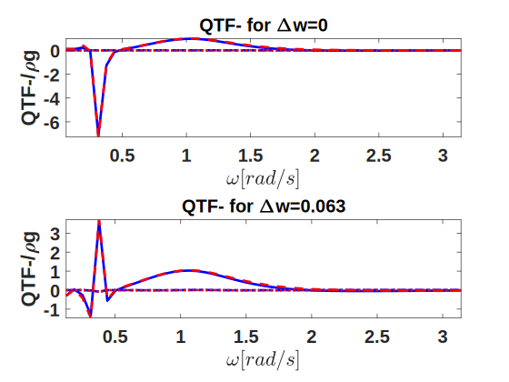

   Comparison of the off-diagonal bi-directional, :math:`(\beta_1,\beta_2)=(0^{\circ},30^{\circ})`, heave difference frequency QTF for the SOFTWIND platform (test case **10a_QTF_SOFTWIND**) between HYDROSTAR, real part (blue, solid-line), imaginary part (blue, dashed-dot line) and NEMOH, real part (red, dashed-line), imaginary part (red, dotted-line).

.. _`fig:QTFM_diag_softwind_pitch`:
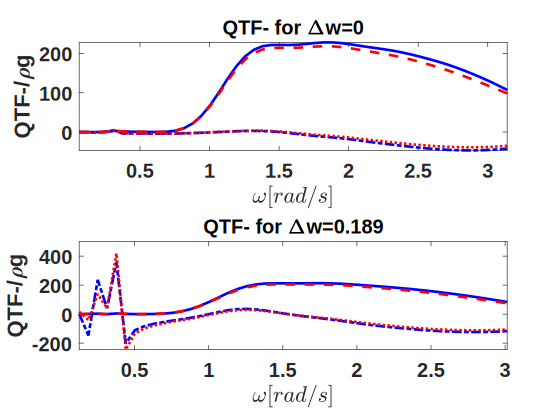

   Comparison of the off-diagonal bi-directional, :math:`(\beta_1,\beta_2)=(0^{\circ},30^{\circ})`, pitch difference frequency QTF for the SOFTWIND platform (test case **10a_QTF_SOFTWIND**) between HYDROSTAR, real part (blue, solid-line), imaginary part (blue, dashed-dot line) and NEMOH, real part (red, dashed-line), imaginary part (red, dotted-line).

*******************
10b_QTF_SOFTWIND_FS
*******************

Half symmetric body mesh without lid panels, half symmetric free-surface mesh, CoG :math:`(0,0,-71.56)`, water depth 200 m, wave direction :math:`0^{\circ}`, the sum-frequency total QTF DUOK+HASBO+HASFS+ASYMP. The results are shown in the density plot, :numref:`fig:QTFP_SOFTWIND_surge`, :numref:`fig:QTFP_SOFTWIND_heave` and :numref:`fig:QTFP_SOFTWIND_pitch` and in the off-diagonal line plot, :numref:`fig:QTFP_SOFTWIND_DIAG_surge`, :numref:`fig:QTFP_SOFTWIND_DIAG_heave` and :numref:`fig:QTFP_SOFTWIND_DIAG_pitch`. The mesh used was obtained using GMSH :cite:p:`GMSH` and is shown in :numref:`fig:meshesSoftwind_body` and :numref:`fig:meshesSoftwind_FS`.

.. _`fig:QTFP_SOFTWIND_surge`:
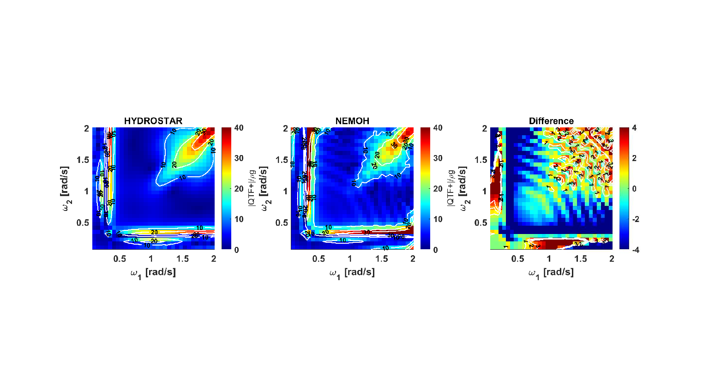

   Density plots of the normalized surge sum-frequency full QTF magnitude (including the free-surface integrals) for the floating SOFTWIND platform (test case **10b_QTF_SOFTWIND_FS**). HYDROSTAR results are on the left column, NEMOH results are on the middle column and the difference in the right column.

.. _`fig:QTFP_SOFTWIND_heave`:
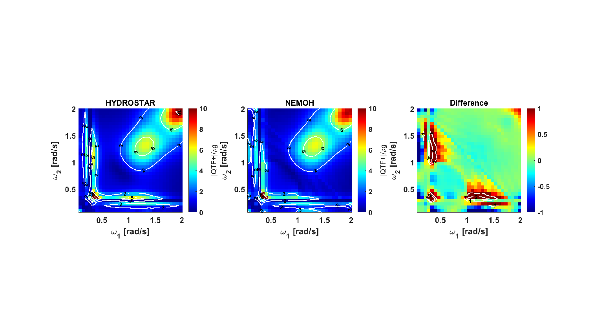

   Density plots of the normalized heave sum-frequency full QTF magnitude (including the free-surface integrals) for the floating SOFTWIND platform (test case **10b_QTF_SOFTWIND_FS**). HYDROSTAR results are on the left column, NEMOH results are on the middle column and the difference in the right column.

.. _`fig:QTFP_SOFTWIND_pitch`:
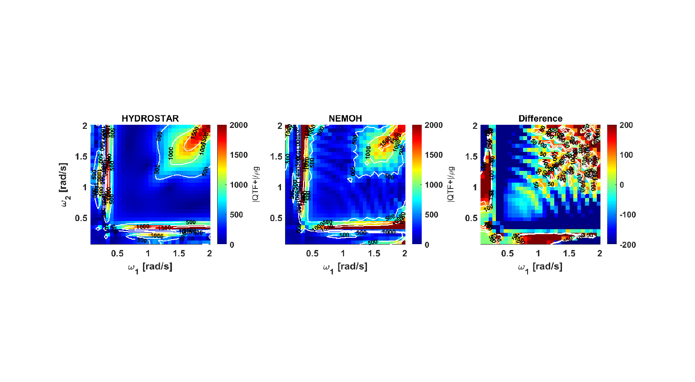

   Density plots of the normalized pitch sum-frequency full QTF magnitude (including the free-surface integrals) for the floating SOFTWIND platform (test case **10b_QTF_SOFTWIND_FS**). HYDROSTAR results are on the left column, NEMOH results are on the middle column and the difference in the right column.

.. _`fig:QTFP_SOFTWIND_DIAG_surge`:
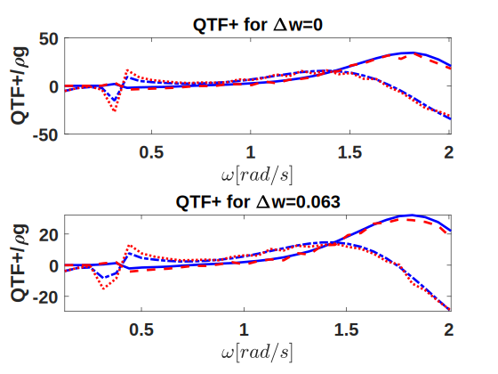

   Comparison of the off-diagonal surge sum-frequency full QTF for SOFTWIND platform (test case **10b_QTF_SOFTWIND_FS**) between HYDROSTAR, real part (blue, solid-line), imaginary part (blue, dashed-dot line) and NEMOH, real part (red, dashed-line), imaginary part (red, dotted-line).

.. _`fig:QTFP_SOFTWIND_DIAG_heave`:
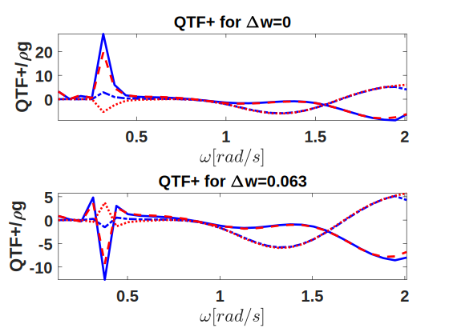

   Comparison of the off-diagonal heave sum-frequency full QTF for SOFTWIND platform (test case **10b_QTF_SOFTWIND_FS**) between HYDROSTAR, real part (blue, solid-line), imaginary part (blue, dashed-dot line) and NEMOH, real part (red, dashed-line), imaginary part (red, dotted-line).

.. _`fig:QTFP_SOFTWIND_DIAG_pitch`:
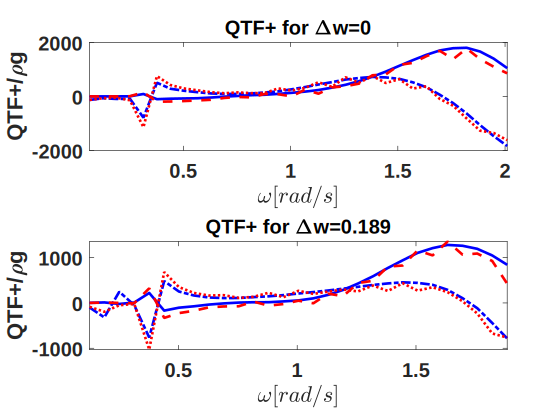

   Comparison of the off-diagonal pitch sum-frequency full QTF for SOFTWIND platform (test case **10b_QTF_SOFTWIND_FS**) between HYDROSTAR, real part (blue, solid-line), imaginary part (blue, dashed-dot line) and NEMOH, real part (red, dashed-line), imaginary part (red, dotted-line).

*****************
11_QTF_OC3_Hywind
*****************

Full body mesh with lid panels, CoG :math:`(0,0,0)`, water depth 320 m, wave direction :math:`0^{\circ}`, NEMOH1 uses GMRES solver, the difference-frequency QTF DUOK+HASBO. The results are shown in the density plot, :numref:`fig:QTFM_OC3_HYWIND_surge`, :numref:`fig:QTFM_OC3_HYWIND_heave` and :numref:`fig:QTFM_OC3_HYWIND_pitch`, and in the off-diagonal line plot, :numref:`fig:QTFM_diag_OC3_HYWIND_surge`, :numref:`fig:QTFM_diag_OC3_HYWIND_heave` and :numref:`fig:QTFM_diag_OC3_HYWIND_pitch`, of the difference-frequency QTF. The mesh used was obtained using GMSH :cite:p:`GMSH` and is shown in :numref:`fig:meshesHYWIND`.

.. _`fig:meshesHYWIND`:
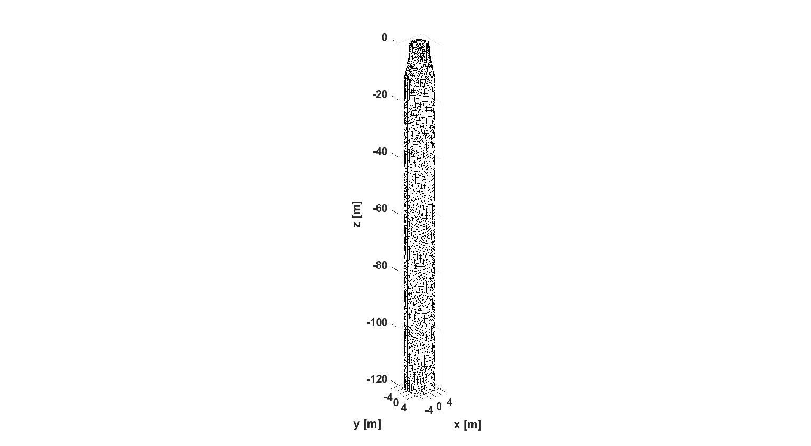

   Body boundary mesh for OC3-HYWIND platform, test case **11_QTF_OC3_Hywind**.

.. _`fig:QTFM_OC3_HYWIND_surge`:
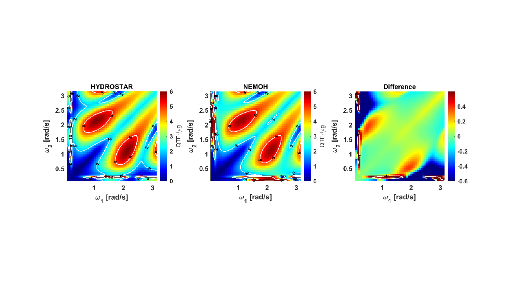

   Density plots of the normalized surge difference frequency QTF magnitude (without the free-surface integrals) for the floating OC3-HYWIND platform (test case **11_QTF_OC3_Hywind**). HYDROSTAR results are on the left column, NEMOH results are on the middle column and the difference on the right column.

.. _`fig:QTFM_OC3_HYWIND_heave`:
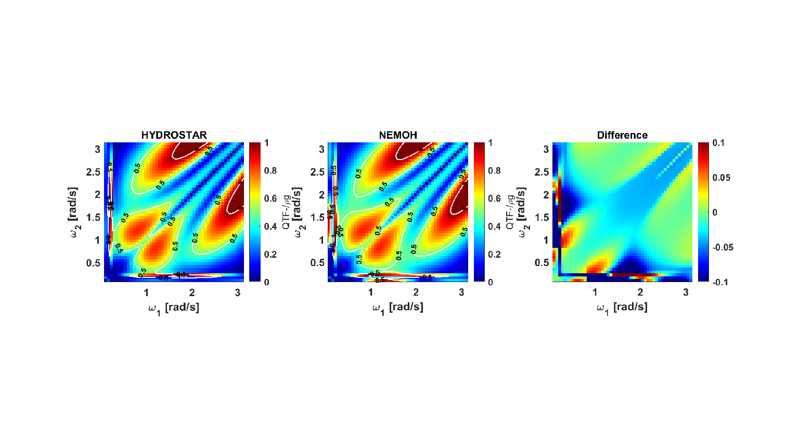

   Density plots of the normalized heave difference frequency QTF magnitude (without the free-surface integrals) for the floating OC3-HYWIND platform (test case **11_QTF_OC3_Hywind**). HYDROSTAR results are on the left column, NEMOH results are on the middle column and the difference on the right column.

.. _`fig:QTFM_OC3_HYWIND_pitch`:
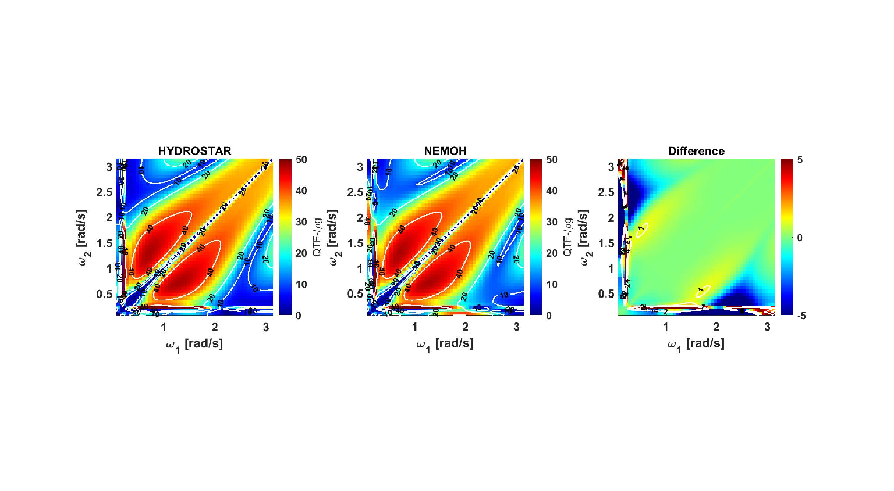

   Density plots of the normalized pitch difference frequency QTF magnitude (without the free-surface integrals) for the floating OC3-HYWIND platform (test case **11_QTF_OC3_Hywind**). HYDROSTAR results are on the left column, NEMOH results are on the middle column and the difference on the right column.

.. _`fig:QTFM_diag_OC3_HYWIND_surge`:
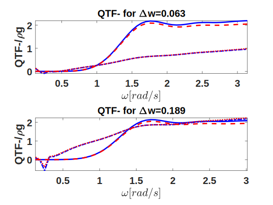

   Comparison of the off-diagonal surge difference frequency QTF for the OC3-HYWIND platform (test case **11_QTF_OC3_Hywind**) between HYDROSTAR, real part (blue, solid-line), imaginary part (blue, dashed-dot line) and NEMOH, real part (red, dashed-line), imaginary part (red, dotted-line).

.. _`fig:QTFM_diag_OC3_HYWIND_heave`:
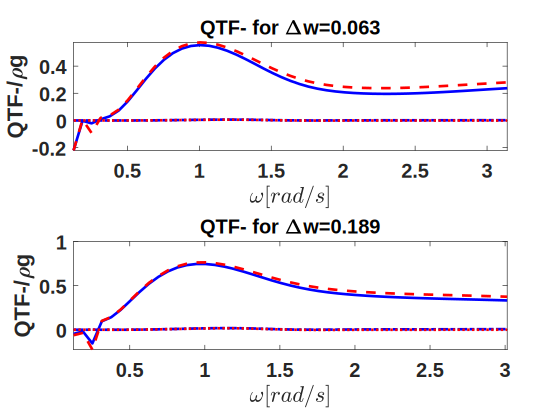

   Comparison of the off-diagonal heave difference frequency QTF for the OC3-HYWIND platform (test case **11_QTF_OC3_Hywind**) between HYDROSTAR, real part (blue, solid-line), imaginary part (blue, dashed-dot line) and NEMOH, real part (red, dashed-line), imaginary part (red, dotted-line).

.. _`fig:QTFM_diag_OC3_HYWIND_pitch`:
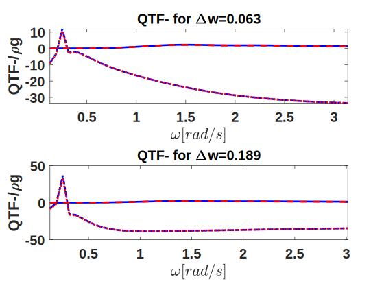

   Comparison of the off-diagonal pitch difference frequency QTF for the OC3-HYWIND platform (test case **11_QTF_OC3_Hywind**) between HYDROSTAR, real part (blue, solid-line), imaginary part (blue, dashed-dot line) and NEMOH, real part (red, dashed-line), imaginary part (red, dotted-line).

Full description of the QTF test-cases results is reported in :cite:t:`Kurnia22_JH,Kurnia22`. Note that the QTF comparisons between NEMOH and HYDROSTAR for the bidirectional case are in good agreement only if the direction is switched, in NEMOH :math:`\beta=(\beta_1,\beta_2)` and in Hydrostar :math:`\beta=(\beta_2,\beta_1)`; further investigation regarding this is needed. The imaginary part of QTFs have also a difference sign between NEMOH and HYDROSTAR that may be due to different conventions of the incident potential.
